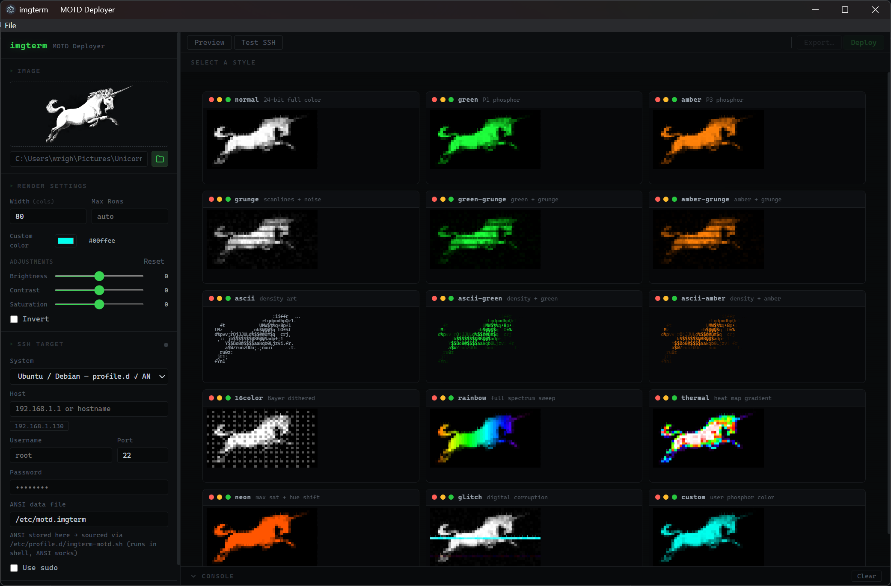
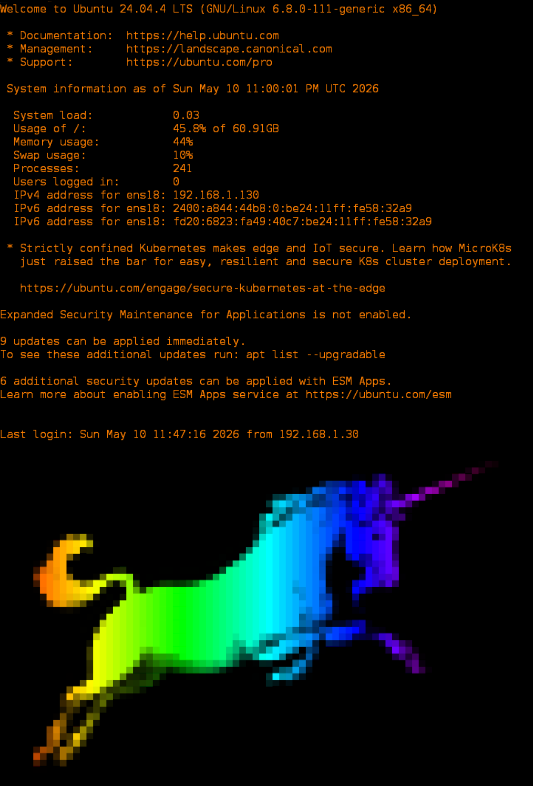

# imgterm

Convert any image to ANSI terminal art and deploy it as your SSH server's MOTD (message of the day).





## Features

- **15 render styles** — normal, green/amber phosphor, grunge overlays, ASCII art, 16-colour, rainbow, thermal, neon, glitch, and a custom colour picker
- **Image adjustments** — brightness, contrast, saturation, and invert, previewed live
- **One-click deploy** — upload directly to a remote server over SSH/SFTP with optional sudo
- **Ubuntu/Debian aware** — deploys via `profile.d` so ANSI colours survive the PAM layer
- **Test before you deploy** — fetch and render the current MOTD straight from the server
- **Cross-platform GUI** — Electron app that runs on Windows, Linux, and macOS

## Download

Grab the latest installer or portable binary from the [Releases](../../releases) page:

| Platform | File |
|---|---|
| Windows (installer) | `imgterm-Setup-x.x.x.exe` |
| Windows (portable)  | `imgterm-x.x.x-portable.exe` |
| Linux (AppImage)    | `imgterm-x.x.x.AppImage` |
| Linux (deb)         | `imgterm_x.x.x_amd64.deb` |
| macOS               | `imgterm-x.x.x.dmg` |

## Building from source

### Prerequisites

- [Rust](https://rustup.rs/) (stable)
- [Node.js](https://nodejs.org/) 18+

### 1 — Build the imgterm CLI

```sh
cargo build --release
```

This produces `target/release/imgterm` (or `imgterm.exe` on Windows).

### 2 — Run the GUI in development mode

```sh
cd gui
npm install
npm start
```

### 3 — Package the GUI as an installer

```sh
cd gui
npm install
npm run dist          # builds for the current platform
npm run dist:win      # Windows NSIS installer + portable
npm run dist:linux    # AppImage + .deb
npm run dist:mac      # DMG (requires macOS)
```

The packaged app bundles the `imgterm` binary automatically — users don't need Rust installed.

## CLI usage

The `imgterm` binary can also be used standalone:

```
imgterm [OPTIONS] <IMAGE>

Options:
  -w <cols>     Output width in columns (default: terminal width)
  -r <rows>     Maximum number of rows
  -m <mode>     Render mode (see below)
  -c <RRGGBB>   Custom phosphor colour (hex, e.g. 00ffee)

Modes:
  normal, green, amber, grunge, green-grunge, amber-grunge,
  ascii, ascii-green, ascii-amber, 16color,
  rainbow, thermal, neon, glitch, custom
```

**Example:**

```sh
imgterm -w 80 -m green /path/to/image.png > /etc/motd
```

## Deploying manually (no GUI)

### Ubuntu / Debian — profile.d (recommended, ANSI works)

```sh
# Copy ANSI art to the data file
sudo cp motd.ans /etc/motd.imgterm

# Create a profile.d script that cats it on login
printf '#!/bin/sh\n[ -f /etc/motd.imgterm ] && cat /etc/motd.imgterm\n' \
  | sudo tee /etc/profile.d/imgterm-motd.sh
sudo chmod 755 /etc/profile.d/imgterm-motd.sh
```

### Standard Linux (write directly to /etc/motd)

```sh
sudo cp motd.ans /etc/motd
```

### One-liner (pipe over SSH)

```sh
imgterm -w 80 image.png | ssh user@host 'sudo tee /etc/motd'
```

## Licence

MIT
